# Form Data Model & Cascade Behaviors

## Overview

This document maps the database entity hierarchy, foreign key relationships, and delete cascade behaviors for the form-related tables.

---

## Entity Hierarchy

### Conceptual vs Actual Structure

**User's Mental Model (Intuitive):**
```
forms → flows → steps → questions → options
```

**Actual Database Structure:**

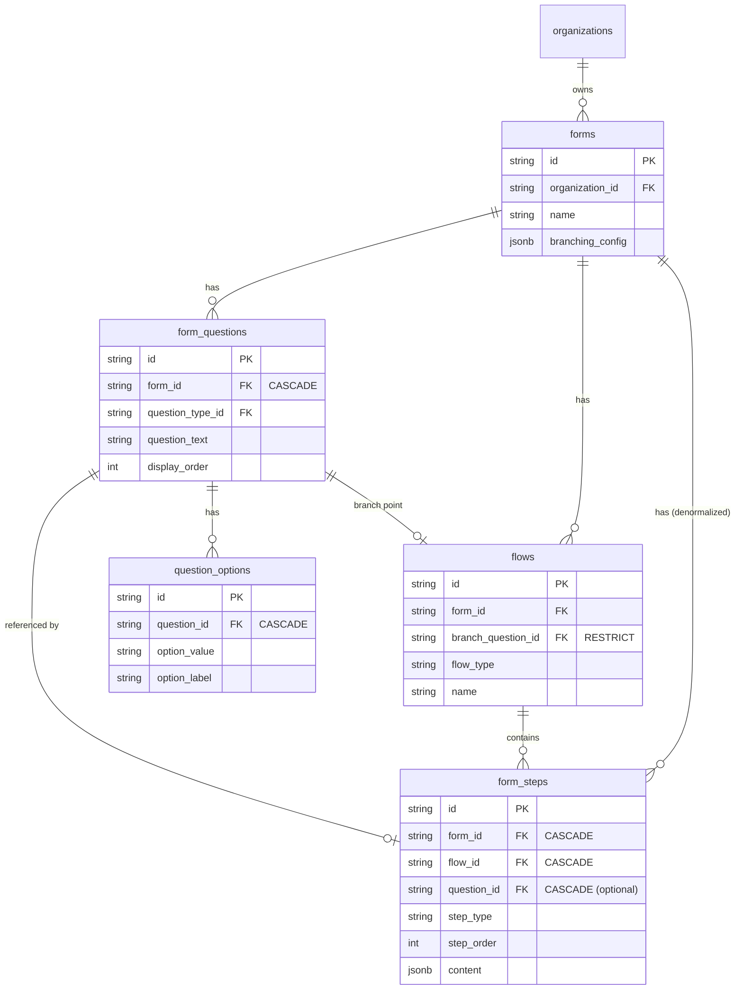

**Key Insight:** Questions are **form-level entities**, not step-owned. Steps merely **reference** questions via an optional FK.

---

## Foreign Key Relationships

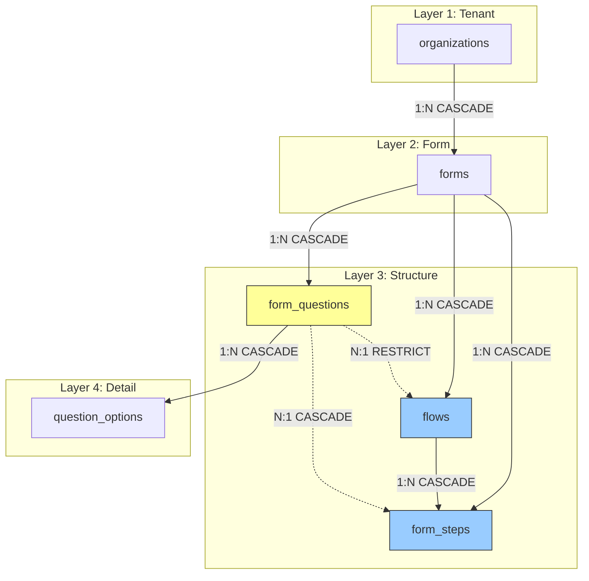

---

## FK Constraints Summary

### forms

| Column | References | ON DELETE | ON UPDATE |
|--------|------------|-----------|-----------|
| `organization_id` | organizations.id | CASCADE | CASCADE |
| `created_by` | users.id | SET NULL | CASCADE |
| `updated_by` | users.id | SET NULL | CASCADE |

### flows

| Column | References | ON DELETE | ON UPDATE |
|--------|------------|-----------|-----------|
| `form_id` | forms.id | **CASCADE** | CASCADE |
| `organization_id` | organizations.id | RESTRICT | CASCADE |
| `branch_question_id` | form_questions.id | **RESTRICT** | CASCADE |

### form_steps

| Column | References | ON DELETE | ON UPDATE |
|--------|------------|-----------|-----------|
| `form_id` | forms.id | **CASCADE** | CASCADE |
| `flow_id` | flows.id | **CASCADE** | CASCADE |
| `organization_id` | organizations.id | RESTRICT | CASCADE |
| `question_id` | form_questions.id | **CASCADE** | CASCADE |
| `created_by` | users.id | SET NULL | CASCADE |
| `updated_by` | users.id | SET NULL | CASCADE |

**Additional:** `trg_form_steps_delete_question` trigger (AFTER DELETE) - deletes associated question

### form_questions

| Column | References | ON DELETE | ON UPDATE |
|--------|------------|-----------|-----------|
| `organization_id` | organizations.id | CASCADE | CASCADE |
| `form_id` | forms.id | **CASCADE** | CASCADE |
| `question_type_id` | question_types.id | RESTRICT | CASCADE |
| `updated_by` | users.id | SET NULL | CASCADE |

### question_options

| Column | References | ON DELETE | ON UPDATE |
|--------|------------|-----------|-----------|
| `organization_id` | organizations.id | CASCADE | CASCADE |
| `question_id` | form_questions.id | **CASCADE** | CASCADE |
| `created_by` | users.id | SET NULL | CASCADE |

---

## Delete Cascade Scenarios

### Scenario 1: Delete Form

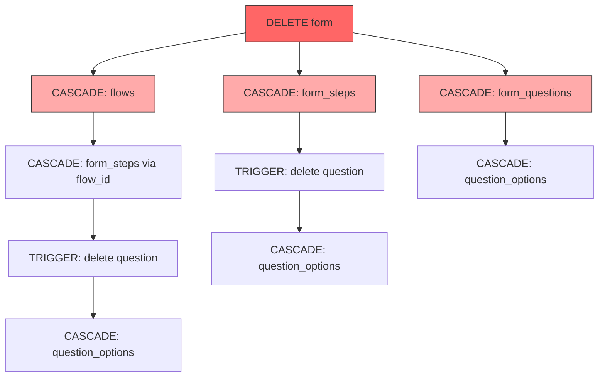

**Result:** Everything deleted. Form deletion is a clean cascade.

---

### Scenario 2: Delete Flow

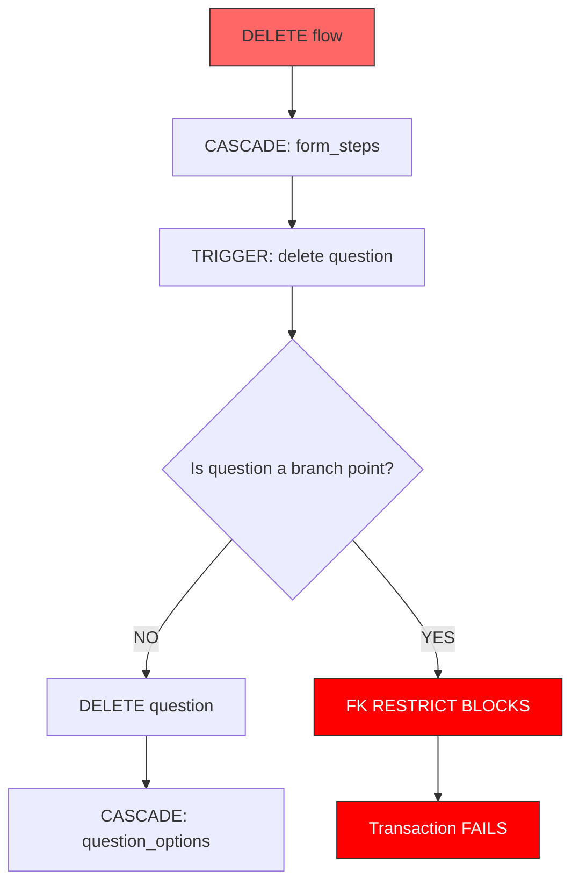

**Edge Case:** If a flow contains a step with a question that is used as a branch point by another flow, the delete will fail.

---

### Scenario 3: Delete Step

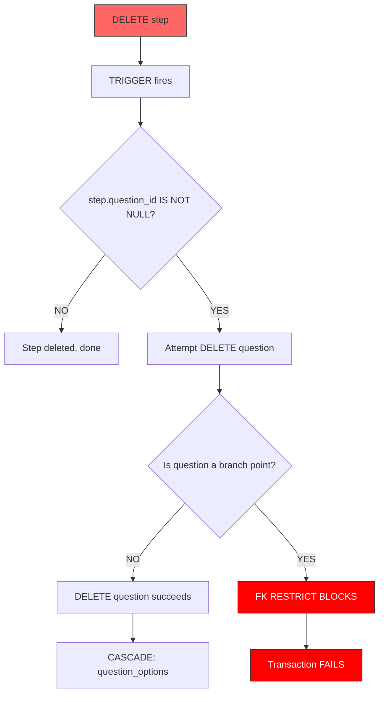

**Important:** You cannot delete a step that has a question used as a branch point.

---

### Scenario 4: Delete Question (Direct)

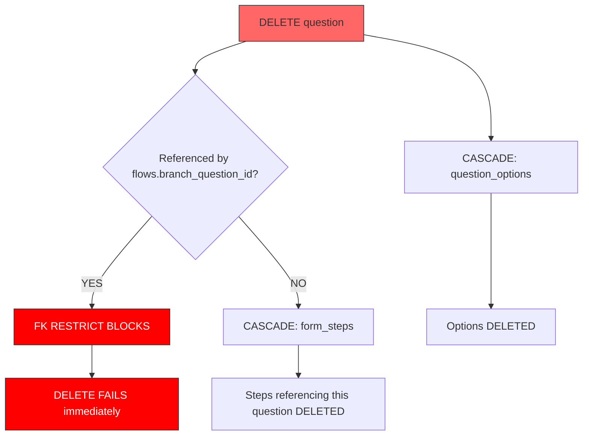

**Bi-directional Cascade Note:**
- Delete question → cascades to delete step (via FK)
- Delete step → trigger deletes question

This is consistent but creates mutual deletion. Either operation cleans up both.

---

### Scenario 5: Delete Question Options

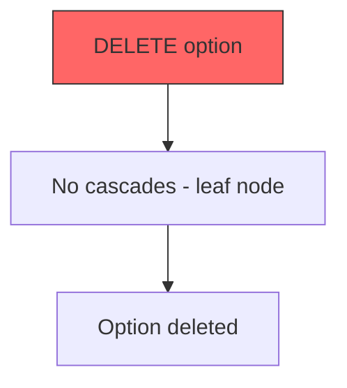

---

## Branch Point Protection

### What is a Branch Point?

A question used for conditional branching (e.g., rating question that splits flow into testimonial vs improvement paths).

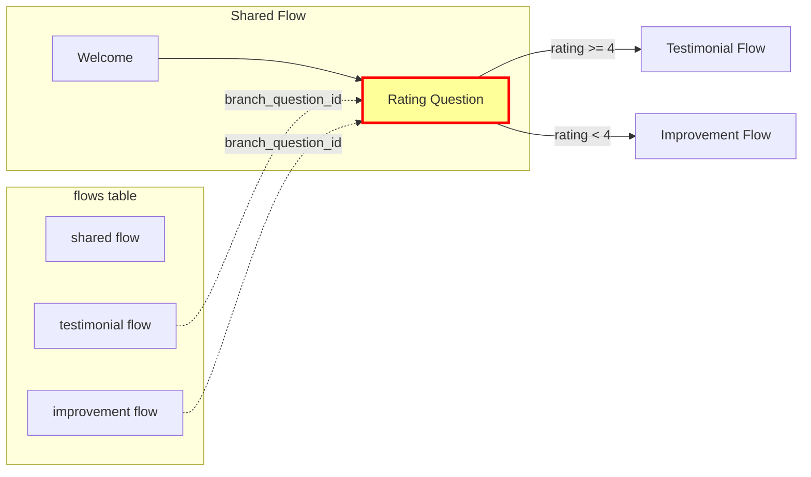

The rating question is **protected** by `ON DELETE RESTRICT` - it cannot be deleted while flows reference it.

### Protection Rules

| Operation | Branch Point Question | Non-Branch Question |
|-----------|----------------------|---------------------|
| Delete question directly | **BLOCKED** | Allowed (cascades to step) |
| Delete step with question | **BLOCKED** | Allowed (trigger deletes question) |
| Delete flow containing step | **BLOCKED** | Allowed |
| Delete form | **ALLOWED** | Allowed (cascade cleans all) |

### How to Delete a Branch Point Question

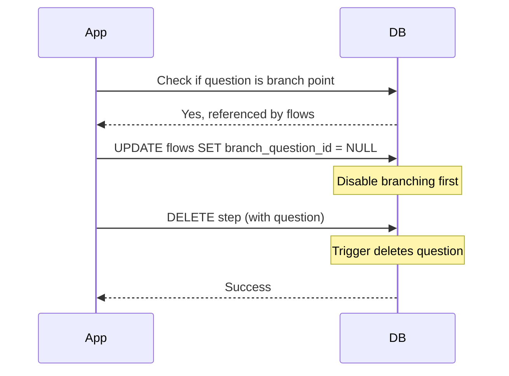

**Application Code Pattern:**
```typescript
async function deleteRatingStep(stepId: string) {
  const step = await getStep(stepId);
  const isBranchPoint = await isBranchPointQuestion(step.question_id);

  if (isBranchPoint) {
    // 1. Disable branching first
    await disableBranching(formId);
  }

  // 2. Now safe to delete step
  await deleteStep(stepId);
}
```

---

## Dual Parentage: form_steps

### Why Steps Have Both form_id AND flow_id

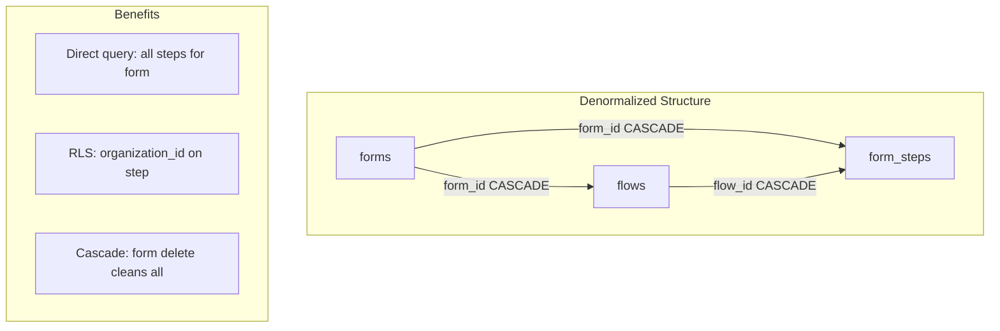

**Reasons:**

1. **Query Performance:** Direct access to all steps for a form without joining flows
2. **RLS Efficiency:** `organization_id` denormalized for row-level security
3. **Cascade Simplicity:** Form deletion cascades directly to steps

**Consistency Guarantee:** When creating steps, application must ensure:
```
step.form_id = flow.form_id
step.organization_id = form.organization_id
```

---

## Summary: Delete Behavior Matrix

| Entity Deleted | flows | form_steps | form_questions | question_options |
|----------------|-------|------------|----------------|------------------|
| **form** | CASCADE | CASCADE | CASCADE | CASCADE |
| **flow** | - | CASCADE | Trigger* | CASCADE* |
| **step** | - | - | Trigger* | CASCADE* |
| **question** | RESTRICT** | CASCADE | - | CASCADE |
| **option** | - | - | - | - |

\* Via trigger `trg_form_steps_delete_question`
\*\* If question is branch point

---

## Application Code Implications

### Safe Deletion Order

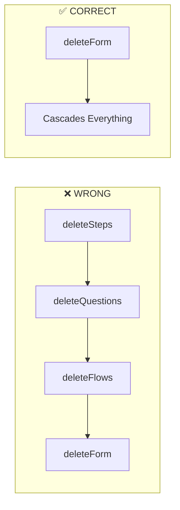

**Best Practice:** Let database cascades handle cleanup. Delete the form, everything else follows.

### When Deleting Individual Entities

```typescript
// Delete step safely
async function safeDeleteStep(stepId: string): Promise<boolean> {
  const step = await getStep(stepId);

  // Check if question is protected
  if (step.question_id) {
    const isProtected = await isBranchPointQuestion(step.question_id);
    if (isProtected) {
      throw new Error('Cannot delete step: question is branch point. Disable branching first.');
    }
  }

  // Safe to delete - trigger handles question cleanup
  await deleteFormStep(stepId);
  return true;
}
```

---

## Historical Context: Why Questions Are Form-Level

### The Question

> Why is `form_questions` directly under `forms` instead of under `form_steps`?

### Answer: Historical Artifact

**There is no documented design reasoning.** The current structure is a result of incremental schema evolution:

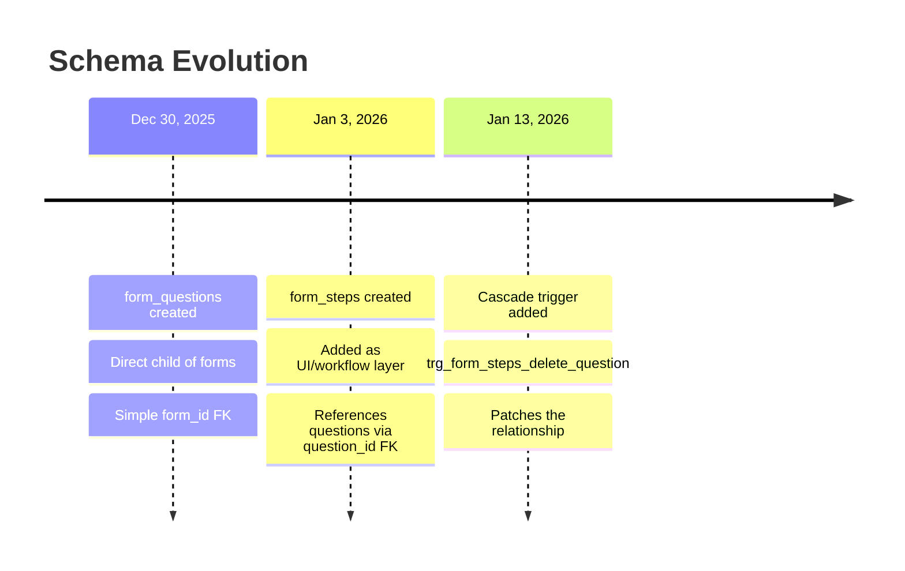

### Migration Timestamps (Evidence)

| Migration | Timestamp | Date |
|-----------|-----------|------|
| `form_questions__create_table` | 1767078192000 | Dec 30, 2025 |
| `form_steps__create_table` | 1767425106405 | Jan 3, 2026 |
| `form_steps__add_question_cascade_trigger` | 1768018796784 | Jan 13, 2026 |

**Key Insight:** Questions were created **4 days before** steps existed. The schema was not restructured when steps were added.

### ADR-009 Confirmation

ADR-009 states:
> "Steps and questions have 1:1 relationship"

This confirms the design intent: **every question belongs to exactly one step**. There is no use case for orphan questions.

### Current Consequences

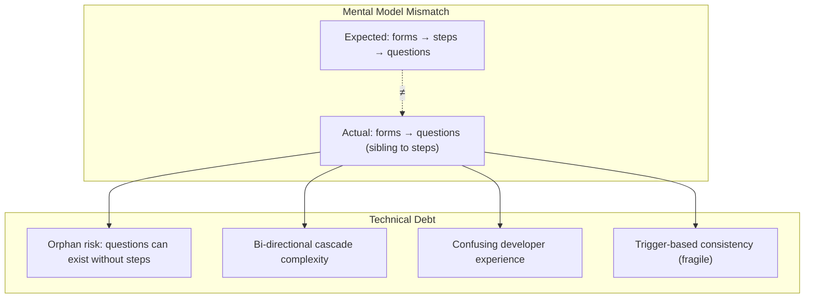

### Potential Refactor (Not Recommended for MVP)

The "correct" structure would be:

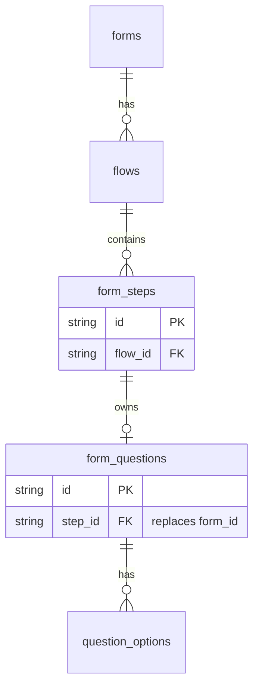

**Why Not Refactor Now:**
1. Requires data migration for existing forms
2. All GraphQL queries/mutations need updating
3. Application code assumes current structure
4. Risk of breaking existing functionality

**Recommendation:** Document as technical debt, address post-MVP if needed.

---

## References

- `db/hasura/migrations/default/1767078132000__forms__create_table/up.sql`
- `db/hasura/migrations/default/1767693641260__flows__create_table/up.sql`
- `db/hasura/migrations/default/1767425106405__form_steps__create_table/up.sql`
- `db/hasura/migrations/default/1768018796784__form_steps__add_question_cascade_trigger/up.sql`
- `db/hasura/migrations/default/1768018541454__flows__add_branch_columns/up.sql`
- `docs/adr/009-step-based-form-architecture/adr.md` (1:1 relationship confirmation)
