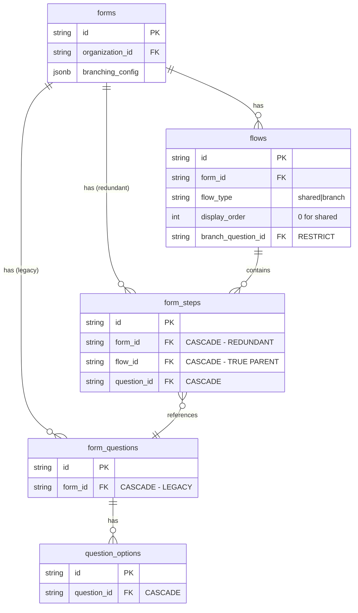
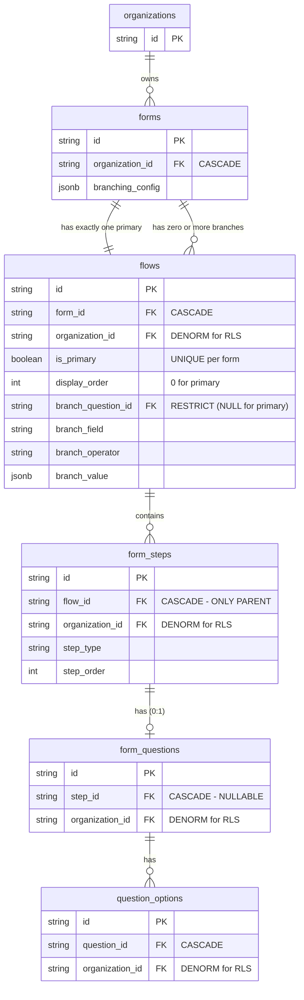
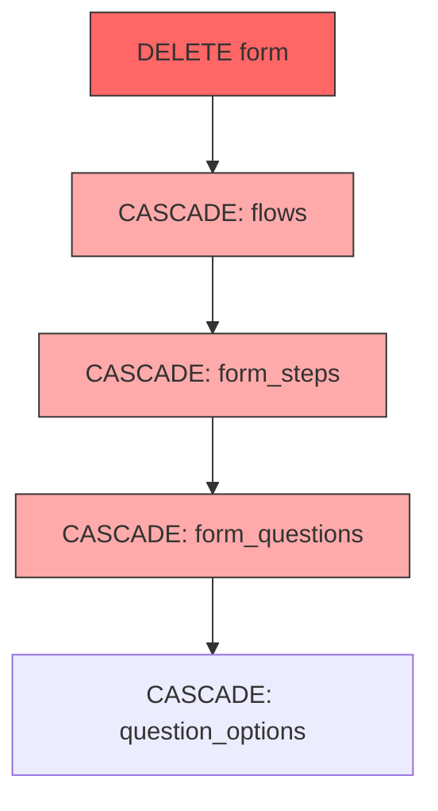
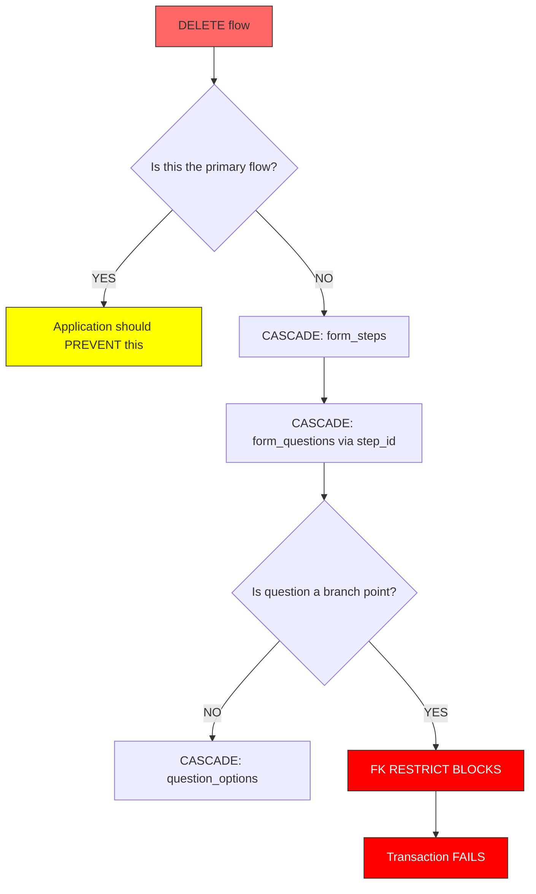
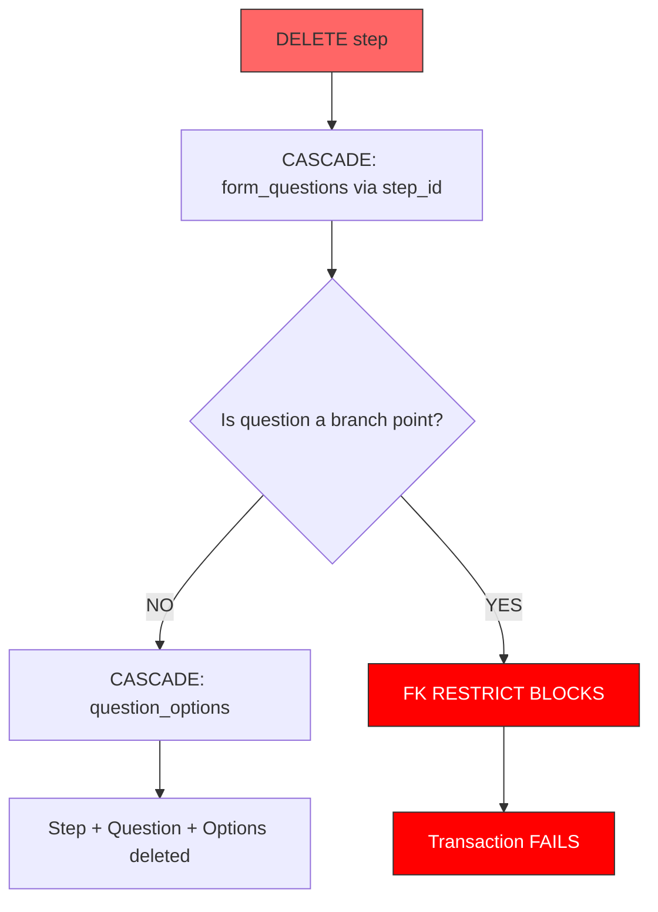
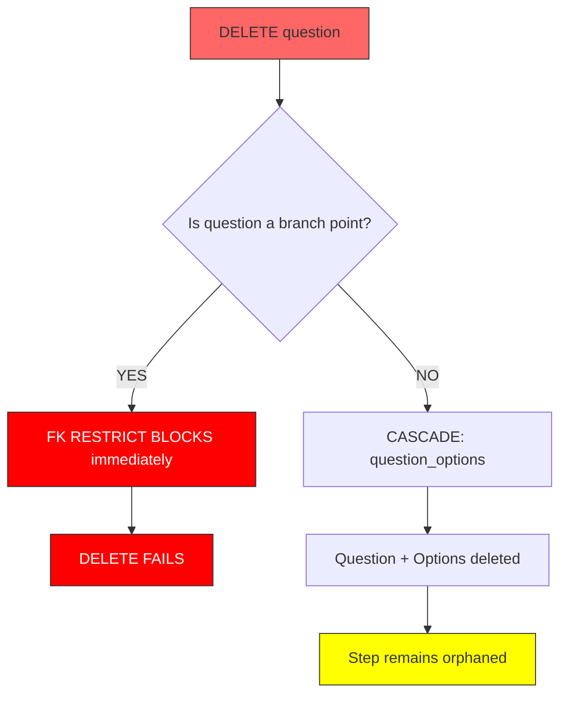
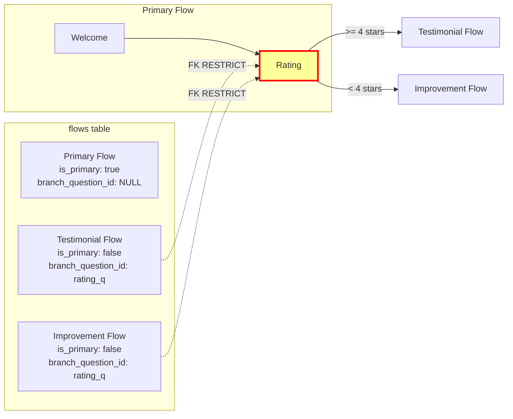
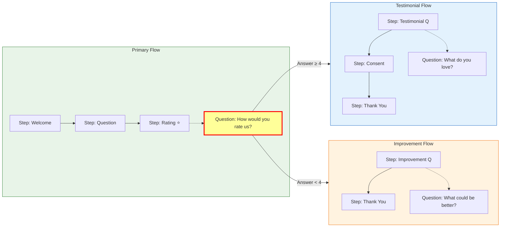
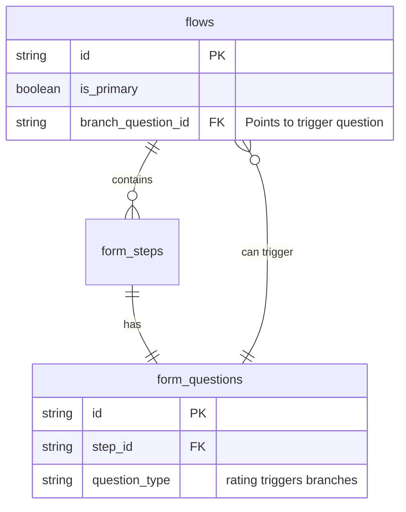
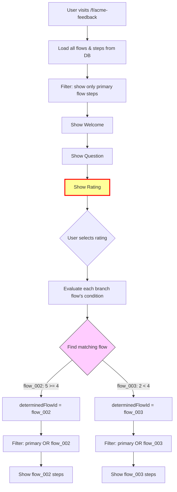

# ADR-013: Form Entities Schema Refactoring

## Status
**Accepted** - January 2026

## Table of Contents

1. [Part 1: Data Ownership Model](#part-1-data-ownership-model) - Current vs target schema
2. [Part 2: Cascade Behaviors](#part-2-cascade-behaviors) - FK constraints and delete scenarios
3. [Part 3: Flow Construction Mental Model](#part-3-flow-construction-mental-model) - Runtime stitching
4. [Part 4: How Branching Works](#part-4-how-branching-works-concrete-example) - Concrete "Acme SaaS" example
5. [Part 5: Decision](#part-5-decision) - What we're doing
6. [Part 6: Changes Required](#part-6-changes-required) - Database, code, GraphQL changes
7. [Part 7: Consequences](#part-7-consequences) - Trade-offs

---

## Context

The current database schema has legacy artifacts from incremental development where entities have foreign keys that don't match the intended ownership hierarchy. This document defines the target data model, ownership rules, cascade behaviors, and how branching works.

**Historical Background:**
- `form_questions` was created (Dec 30, 2025) before `form_steps` (Jan 3, 2026)
- `form_steps` was created before `flows` (Jan 7, 2026)
- The schema was patched with triggers and conventions rather than restructured

---

## Part 1: Data Ownership Model

### Current State (Legacy)



**Problems:**
| Issue | Description |
|-------|-------------|
| `form_questions.form_id` | Questions are form-level but always belong to a step (1:1) |
| `form_steps.form_id` | Steps have dual parentage (form + flow) |
| `flow_type = 'shared'` | Magic string convention, not enforced |
| No primary flow guarantee | Forms could theoretically have zero or multiple "shared" flows |
| Cascade trigger | `trg_form_steps_delete_question` patches what FK should handle |

---

### Target State (Clean)



**Key Changes:**
1. `form_id` is **removed** from `form_steps` and `form_questions`
2. `question_id` is **removed** from `form_steps` (inverted to `step_id` on questions)
3. `organization_id` **remains** on all tables (intentional denormalization for Hasura RLS)
4. `step_id` is **nullable** - steps can exist without questions (welcome, thank_you, etc.)

The ownership chain is:
```
form → flow → step → question → options
```

Clean hierarchy with minimal denormalization (only `organization_id` for security).

---

### Ownership Hierarchy

```
Organization (tenant boundary)
└── Form
    ├── Primary Flow (exactly one, is_primary=true)
    │   └── Steps[] (ordered by step_order)
    │       └── Question (1:1, optional for non-question steps)
    │           └── Options[] (for choice questions)
    │
    └── Branch Flows[] (zero or more, is_primary=false)
        └── Steps[]
            └── Question
                └── Options[]
```

**Key Rules:**
1. Every form has exactly ONE primary flow (`is_primary = true`)
2. Primary flows have NO branch conditions (all branch columns NULL)
3. Branch flows reference a question as their branch point
4. Steps belong to exactly one flow (`flow_id` is the ONLY parent)
5. Questions belong to exactly one step (`step_id` is the ONLY parent)
6. **No `form_id` on steps/questions** - derive via joins if needed

---

## Part 2: Cascade Behaviors

### FK Constraints Summary (Target State)

| Table | Column | References | ON DELETE | Purpose |
|-------|--------|------------|-----------|---------|
| **forms** | organization_id | organizations.id | CASCADE | Tenant cleanup |
| **flows** | form_id | forms.id | CASCADE | Form cleanup |
| **flows** | organization_id | organizations.id | CASCADE | Tenant boundary (RLS) |
| **flows** | branch_question_id | form_questions.id | **RESTRICT** | Protect branch points |
| **form_steps** | flow_id | flows.id | CASCADE | Flow cleanup (ONLY parent) |
| **form_steps** | organization_id | organizations.id | CASCADE | Tenant boundary (RLS) |
| **form_questions** | step_id | form_steps.id | CASCADE | Step cleanup (NULLABLE) |
| **form_questions** | organization_id | organizations.id | CASCADE | Tenant boundary (RLS) |
| **question_options** | question_id | form_questions.id | CASCADE | Question cleanup |
| **question_options** | organization_id | organizations.id | CASCADE | Tenant boundary (RLS) |

**Removed FKs:**
- ~~`form_steps.form_id`~~ - No longer needed, derive via `step.flow.form_id`
- ~~`form_steps.question_id`~~ - Inverted, questions now reference steps
- ~~`form_questions.form_id`~~ - No longer needed, derive via `question.step.flow.form_id`

**Kept (Intentional Denormalization):**
- `organization_id` on ALL tables - Required for Hasura row-level security without expensive joins

---

### Delete Cascade Scenarios

#### Scenario 1: Delete Form (Clean Cascade)



**Result:** Single cascade chain: `form → flows → steps → questions → options`. Clean and simple.

---

#### Scenario 2: Delete Flow



**Application Rule:** Never delete the primary flow. Delete the form instead.

---

#### Scenario 3: Delete Step



**Note:** With `step_id` FK, the cascade trigger is no longer needed. The FK handles it.

---

#### Scenario 4: Delete Question Directly



**Application Rule:** Delete the step, not the question directly. Step deletion cascades cleanly.

---

### Branch Point Protection

A **branch point** is a question (typically rating) that determines which flow path the respondent takes.



**Protection Rules:**

| Operation | Branch Point Question | Non-Branch Question |
|-----------|----------------------|---------------------|
| Delete question directly | **BLOCKED** (FK RESTRICT) | Allowed |
| Delete step with question | **BLOCKED** (FK RESTRICT) | Allowed (cascades) |
| Delete flow with question | **BLOCKED** (FK RESTRICT) | Allowed (cascades) |
| Delete form | **ALLOWED** (form cascade clears flows first) | Allowed |

**To Delete a Branch Point Question:**
```typescript
// 1. First disable branching (clears branch_question_id on flows)
await disableBranching(formId);

// 2. Now safe to delete the step (which cascades to question)
await deleteStep(ratingStepId);
```

---

## Part 3: Flow Construction Mental Model

### Two Mental Models

There are **two distinct mental models** to understand:

1. **Ownership Model** (static, database relationships):
   ```
   form → flow → step → question → options
   ```
   This answers: "Who owns what? What cascades when I delete?"

2. **Flow Construction Model** (dynamic, runtime stitching):
   ```
   flow → steps → question → (question can trigger) → flow → steps → question → ...
   ```
   This answers: "How does the respondent's journey get assembled?"

---

### Flow Construction: How Forms Get Stitched

The key insight: **Questions can decide which flow comes next.**



**The Pattern:**
```
Primary Flow
    └── Steps (executed in order)
        └── Question (one per step)
            └── [If rating question] → Triggers branch flow selection
                └── Branch Flow (testimonial OR improvement)
                    └── Steps (executed in order)
                        └── Question (one per step)
                            └── [Could theoretically trigger another branch]
```

---

### How Flows Connect via Questions



**The Circular Reference:**
- Flows contain steps which contain questions
- Questions (specifically rating questions) can trigger other flows
- This creates the `flow → step → question → flow` chain

---

### Runtime Stitching Algorithm

```
1. Start with Primary Flow (is_primary = true)
2. Execute steps in step_order
3. For each step with a question:
   a. If question is the rating question (branch point):
      - Get user's answer
      - Check which branch flow's condition matches
      - Append that flow's steps to the journey
4. Continue until no more steps
```

**Code Representation:**
```typescript
function buildUserJourney(allFlows: Flow[], allSteps: Step[], ratingAnswer: number) {
  const primaryFlow = allFlows.find(f => f.is_primary);
  const journey = [...primaryFlow.steps]; // Start with primary

  // Find the branch point (rating step)
  const ratingStep = journey.find(s => s.step_type === 'rating');

  if (ratingStep && ratingAnswer !== undefined) {
    // Find matching branch flow
    const branchFlow = allFlows.find(f =>
      !f.is_primary &&
      evaluateCondition(f.branch_operator, ratingAnswer, f.branch_value)
    );

    if (branchFlow) {
      // Stitch branch flow's steps after primary
      journey.push(...branchFlow.steps);
    }
  }

  return journey;
}
```

---

### Visual: The Stitching Process

```
DATABASE (static):
┌─────────────────────────────────────────────────────────────────┐
│  Primary Flow          Testimonial Flow      Improvement Flow   │
│  ┌─────────┐           ┌─────────┐           ┌─────────┐        │
│  │ Welcome │           │ Love Q  │           │ Better Q│        │
│  │ Usage Q │           │ Consent │           │ Thanks  │        │
│  │ Rating ★│           │ Thanks  │           └─────────┘        │
│  └─────────┘           └─────────┘                              │
└─────────────────────────────────────────────────────────────────┘
        │                      │                    │
        │                      │                    │
        ▼                      ▼                    ▼
RUNTIME (dynamic stitching):

User rates 5 stars:
┌────────────────────────────────────────────────┐
│  Welcome → Usage Q → Rating ★ → Love Q → Consent → Thanks     │
│  └──── Primary Flow ────┘  └──── Testimonial Flow ────┘       │
└────────────────────────────────────────────────┘

User rates 2 stars:
┌─────────────────────────────────────────┐
│  Welcome → Usage Q → Rating ★ → Better Q → Thanks             │
│  └──── Primary Flow ────┘  └── Improvement ──┘                │
└─────────────────────────────────────────┘
```

---

### Key Insight: Questions as Flow Connectors

**Questions serve a dual purpose:**

| Role | Description |
|------|-------------|
| **Content** | Collect information from the user |
| **Flow Control** | Rating questions determine which flow comes next |

The `branch_question_id` on flows says: "This flow activates when the answer to THIS question meets my condition."

```
Flow "Testimonial" says:
  "I activate when question 'q_rating' has answer >= 4"

Flow "Improvement" says:
  "I activate when question 'q_rating' has answer < 4"
```

---

## Part 4: How Branching Works (Concrete Example)

### The "Acme SaaS" Feedback Form

Let's walk through a complete example. A company called "Acme SaaS" creates a feedback form. Here's what happens:

---

### Step 1: Database Records Created

When the form is created, these records are inserted:

**forms table:**
```
| id       | name              | branching_config                                          |
|----------|-------------------|-----------------------------------------------------------|
| form_abc | Acme SaaS Feedback | {"enabled":true,"threshold":4,"ratingStepId":"step_003"} |
```

**flows table:**
```
| id       | form_id  | is_primary | display_order | name              | branch_question_id | branch_operator            | branch_value                 |
|----------|----------|------------|---------------|-------------------|--------------------|-----------------------------|------------------------------|
| flow_001 | form_abc | true       | 0             | Shared Steps      | NULL               | NULL                        | NULL                         |
| flow_002 | form_abc | false      | 1             | Testimonial Flow  | q_rating           | greater_than_or_equal_to    | {"type":"number","value":4}  |
| flow_003 | form_abc | false      | 2             | Improvement Flow  | q_rating           | less_than                   | {"type":"number","value":4}  |
```

**Notes:**
- `display_order` determines the order flows are processed and displayed in the form editor. Primary flow is always `display_order: 0`.
- **Flow names ("Testimonial Flow", "Improvement Flow") are creation-time defaults.** When the user enables branching, the frontend pre-populates these names as convenience defaults so users don't have to type them every time. Users can rename flows to anything they want.
- **At runtime, use `flow.name` for display.** The system reads the flow's actual `name` field, not hardcoded "testimonial"/"improvement" strings. The evaluation uses `branch_operator` and `branch_value` to determine which flow activates.

**form_steps table:** (Note: no `form_id` - steps belong to flows only)
```
| id       | flow_id  | step_type | step_order | content (simplified)                    |
|----------|----------|-----------|------------|----------------------------------------|
| step_001 | flow_001 | welcome   | 0          | "Welcome! Tell us about your experience" |
| step_002 | flow_001 | question  | 1          | "What do you use Acme for?"            |
| step_003 | flow_001 | rating    | 2          | "How would you rate Acme?" (1-5 stars) |
| step_004 | flow_002 | question  | 0          | "What do you love most about Acme?"    |
| step_005 | flow_002 | consent   | 1          | "Can we share your feedback publicly?" |
| step_006 | flow_002 | thank_you | 2          | "Thank you for your testimonial!"      |
| step_007 | flow_003 | question  | 0          | "What could we do better?"             |
| step_008 | flow_003 | thank_you | 1          | "Thanks for helping us improve!"       |
```

**form_questions table:**
```
| id         | step_id  | question_text                          |
|------------|----------|----------------------------------------|
| q_usage    | step_002 | What do you use Acme for?              |
| q_rating   | step_003 | How would you rate Acme?               |
| q_love     | step_004 | What do you love most about Acme?      |
| q_improve  | step_007 | What could we do better?               |
```

---

### Step 2: User Journey - Happy Customer (5 stars)

**Sarah** visits the form and rates 5 stars:

```
SCREEN 1: Welcome (step_001)
┌─────────────────────────────────────────┐
│  Welcome! Tell us about your experience │
│                                         │
│              [Continue →]               │
└─────────────────────────────────────────┘

SCREEN 2: Question (step_002)
┌─────────────────────────────────────────┐
│  What do you use Acme for?              │
│  ┌─────────────────────────────────┐    │
│  │ Project management and tracking │    │
│  └─────────────────────────────────┘    │
│              [Continue →]               │
└─────────────────────────────────────────┘

SCREEN 3: Rating (step_003) ← BRANCH POINT
┌─────────────────────────────────────────┐
│  How would you rate Acme?               │
│                                         │
│        ★ ★ ★ ★ ★  (5 selected)          │
│                                         │
│              [Continue →]               │
└─────────────────────────────────────────┘

    ↓ Sarah clicks Continue
    ↓ System checks: 5 >= 4? YES → testimonial flow

SCREEN 4: Testimonial Question (step_004)
┌─────────────────────────────────────────┐
│  What do you love most about Acme?      │
│  ┌─────────────────────────────────┐    │
│  │ The intuitive interface and     │    │
│  │ amazing customer support!       │    │
│  └─────────────────────────────────┘    │
│              [Continue →]               │
└─────────────────────────────────────────┘

SCREEN 5: Consent (step_005)
┌─────────────────────────────────────────┐
│  Can we share your feedback publicly?   │
│                                         │
│  [x] Yes, you can use my testimonial    │
│  [ ] No, keep it private                │
│                                         │
│              [Continue →]               │
└─────────────────────────────────────────┘

SCREEN 6: Thank You (step_006)
┌─────────────────────────────────────────┐
│  Thank you for your testimonial!        │
│                                         │
│  Your feedback helps other customers    │
│  discover Acme.                         │
└─────────────────────────────────────────┘
```

**Sarah saw:** Welcome → Question → Rating → Testimonial Q → Consent → Thank You

---

### Step 3: User Journey - Unhappy Customer (2 stars)

**Mike** visits the same form and rates 2 stars:

```
SCREEN 1: Welcome (step_001)
┌─────────────────────────────────────────┐
│  Welcome! Tell us about your experience │
│              [Continue →]               │
└─────────────────────────────────────────┘

SCREEN 2: Question (step_002)
┌─────────────────────────────────────────┐
│  What do you use Acme for?              │
│  ┌─────────────────────────────────┐    │
│  │ Bug tracking                    │    │
│  └─────────────────────────────────┘    │
│              [Continue →]               │
└─────────────────────────────────────────┘

SCREEN 3: Rating (step_003) ← BRANCH POINT
┌─────────────────────────────────────────┐
│  How would you rate Acme?               │
│                                         │
│        ★ ★ ☆ ☆ ☆  (2 selected)          │
│                                         │
│              [Continue →]               │
└─────────────────────────────────────────┘

    ↓ Mike clicks Continue
    ↓ System checks: 2 >= 4? NO → improvement flow

SCREEN 4: Improvement Question (step_007)
┌─────────────────────────────────────────┐
│  What could we do better?               │
│  ┌─────────────────────────────────┐    │
│  │ The search feature is slow and  │    │
│  │ often returns wrong results.    │    │
│  └─────────────────────────────────┘    │
│              [Continue →]               │
└─────────────────────────────────────────┘

SCREEN 5: Thank You (step_008)
┌─────────────────────────────────────────┐
│  Thanks for helping us improve!         │
│                                         │
│  We take all feedback seriously.        │
└─────────────────────────────────────────┘
```

**Mike saw:** Welcome → Question → Rating → Improvement Q → Thank You

---

### The Branching Logic Explained



> Flow names like "Testimonial Flow" and "Improvement Flow" are stored in `flow.name` and used for display only. The branching logic uses `flow.id` and evaluates `branch_operator`/`branch_value`.

---

### How visibleSteps Changes

**Before rating (both users see same thing):**
```typescript
determinedFlowId = null
visibleSteps = [step_001, step_002, step_003]  // primary flow only
```

**After Sarah rates 5 stars:**
```typescript
determinedFlowId = 'flow_002'  // Matched via: rating(5) >= threshold(4)
visibleSteps = [step_001, step_002, step_003, step_004, step_005, step_006]
//              primary   primary   primary   flow_002   flow_002   flow_002
//              (flow.name = "Testimonial Flow")
```

**After Mike rates 2 stars:**
```typescript
determinedFlowId = 'flow_003'  // Matched via: rating(2) < threshold(4)
visibleSteps = [step_001, step_002, step_003, step_007, step_008]
//              primary   primary   primary   flow_003   flow_003
//              (flow.name = "Improvement Flow")
```

---

### Key Code (Frontend)

```typescript
// usePublicFormFlow.ts

// Store the determined flow's ID (not a hardcoded string)
const determinedFlowId = ref<string | null>(null);

// All flows loaded from database
const flows = ref<Flow[]>([]);  // Each flow has: id, name, is_primary, branch_operator, branch_value

// Called when user clicks Continue on rating step
function checkAndDetermineFlow() {
  if (currentStep.value.id === branchingConfig.ratingStepId) {
    const rating = responses.value[currentStep.value.id]; // e.g., 5 or 2

    // Find the matching branch flow by evaluating its condition
    const matchingFlow = flows.value.find(flow => {
      if (flow.is_primary) return false; // Skip primary flow
      return evaluateCondition(flow.branch_operator, rating, flow.branch_value);
    });

    if (matchingFlow) {
      determinedFlowId.value = matchingFlow.id;
    }
  }
}

// Reactive list of steps to show
const visibleSteps = computed(() => {
  const primaryFlow = flows.value.find(f => f.is_primary);

  if (determinedFlowId.value === null) {
    // Before branching: only primary flow steps
    return allSteps.filter(s => s.flow_id === primaryFlow?.id);
  }

  // After branching: primary flow + determined branch flow
  return allSteps.filter(s =>
    s.flow_id === primaryFlow?.id ||
    s.flow_id === determinedFlowId.value
  );
});

// Helper to get the determined flow's display name
const determinedFlowName = computed(() => {
  if (!determinedFlowId.value) return null;
  const flow = flows.value.find(f => f.id === determinedFlowId.value);
  return flow?.name; // Returns "Testimonial Flow" or whatever the user named it
});
```

> **Note:** The code uses `flow.id` for matching and `flow.name` for display. There are no hardcoded "testimonial" or "improvement" strings - these are just default names the frontend suggests during creation.

---

### Why Branch Flows Reference the Rating Question

The `branch_question_id` on flows points to the rating question. This serves two purposes:

1. **Runtime evaluation:** The frontend knows which question's answer to check
2. **Delete protection:** You cannot delete the rating question while flows reference it (FK RESTRICT)

```
flows.branch_question_id ──FK RESTRICT──► form_questions.id (rating question)
```

If you try to delete the rating step/question while branching is enabled:
```
ERROR: update or delete on table "form_questions" violates foreign key constraint
       "fk_flows_branch_question" on table "flows"
```

**Solution:** Disable branching first, then delete the step.

---

## Part 5: Decision

We will refactor the schema to establish clean ownership with **minimal denormalization**.

**Key Principles:**
1. **Single-path ownership:** `form_id` removed from steps and questions - ownership derived via joins
2. **Tenant boundary preserved:** `organization_id` remains denormalized on ALL tables for Hasura row-level security
3. **Destructive migration:** Existing form data will be wiped (MVP iteration phase)

---

## Part 6: Changes Required

### Database Schema Changes

| Table | Change | Details |
|-------|--------|---------|
| **flows** | ADD `is_primary` | Boolean, partial unique constraint per form |
| **form_steps** | DROP `form_id` | Remove column entirely, steps belong to flows only |
| **form_steps** | DROP `question_id` | Remove column, questions reference steps (inverted) |
| **form_questions** | ADD `step_id` | New FK to form_steps (CASCADE), **nullable** |
| **form_questions** | DROP `form_id` | Remove column entirely, questions belong to steps only |
| **form_steps** | DROP trigger | Remove `trg_form_steps_delete_question` (FK handles it) |

**Note on `step_id` nullability:** Steps can exist without questions (welcome, thank_you, consent steps). Questions have optional `step_id` to support this 0:1 relationship.

---

### Explicit Constraints

#### Partial Unique Constraint for Primary Flow
```sql
-- Ensures exactly one primary flow per form
CREATE UNIQUE INDEX idx_flows_primary_per_form
ON flows (form_id)
WHERE is_primary = true;
```

#### Check Constraint: Primary Flows Cannot Have Branch Conditions
```sql
ALTER TABLE flows ADD CONSTRAINT chk_primary_no_branch
CHECK (
  NOT is_primary OR (
    branch_question_id IS NULL AND
    branch_operator IS NULL AND
    branch_value IS NULL
  )
);
```

#### Check Constraint: Branch Flows Must Have Conditions
```sql
ALTER TABLE flows ADD CONSTRAINT chk_branch_requires_conditions
CHECK (
  is_primary OR (
    branch_question_id IS NOT NULL AND
    branch_operator IS NOT NULL
    -- branch_value can be NULL for operators like 'is_empty'
  )
);
```

---

### Performance Indices

To mitigate join overhead after removing `form_id` from child tables:

```sql
-- Efficient lookup: steps by flow
CREATE INDEX idx_form_steps_flow_id ON form_steps(flow_id);

-- Efficient lookup: questions by step
CREATE INDEX idx_form_questions_step_id ON form_questions(step_id);

-- Efficient lookup: flows by form (already exists, verify)
CREATE INDEX idx_flows_form_id ON flows(form_id);

-- Efficient lookup: options by question (already exists, verify)
CREATE INDEX idx_question_options_question_id ON question_options(question_id);
```

**Optional View** for common "get questions by form" pattern:
```sql
CREATE VIEW vw_form_questions_with_context AS
SELECT
  fq.*,
  fs.id AS step_id,
  fs.flow_id,
  f.form_id
FROM form_questions fq
LEFT JOIN form_steps fs ON fq.step_id = fs.id
LEFT JOIN flows f ON fs.flow_id = f.id;
```

---

### Migration Strategy (Destructive)

Since we are in MVP iteration phase, we will use a **destructive migration**:

1. **Truncate form-related data** (forms, flows, steps, questions, options)
2. **Apply schema changes** in a single migration
3. **No backfill required** - users will recreate forms

```sql
-- Migration: 20260112_schema_refactoring_clean_ownership

-- Step 1: Truncate (CASCADE handles dependencies)
TRUNCATE forms CASCADE;

-- Step 2: Add is_primary to flows
ALTER TABLE flows ADD COLUMN is_primary boolean NOT NULL DEFAULT false;

-- Step 3: Add constraints to flows
CREATE UNIQUE INDEX idx_flows_primary_per_form ON flows (form_id) WHERE is_primary = true;

ALTER TABLE flows ADD CONSTRAINT chk_primary_no_branch
CHECK (NOT is_primary OR (branch_question_id IS NULL AND branch_operator IS NULL AND branch_value IS NULL));

ALTER TABLE flows ADD CONSTRAINT chk_branch_requires_conditions
CHECK (is_primary OR (branch_question_id IS NOT NULL AND branch_operator IS NOT NULL));

-- Step 4: Add step_id to form_questions (nullable for steps without questions)
ALTER TABLE form_questions ADD COLUMN step_id text REFERENCES form_steps(id) ON DELETE CASCADE;

-- Step 5: Remove form_id from form_steps
ALTER TABLE form_steps DROP CONSTRAINT IF EXISTS form_steps_form_id_fkey;
ALTER TABLE form_steps DROP COLUMN form_id;

-- Step 6: Remove form_id and question_id from form_steps
ALTER TABLE form_steps DROP CONSTRAINT IF EXISTS form_steps_question_id_fkey;
ALTER TABLE form_steps DROP COLUMN question_id;

-- Step 7: Remove form_id from form_questions
ALTER TABLE form_questions DROP CONSTRAINT IF EXISTS form_questions_form_id_fkey;
ALTER TABLE form_questions DROP COLUMN form_id;

-- Step 8: Drop legacy trigger
DROP TRIGGER IF EXISTS trg_form_steps_delete_question ON form_steps;
DROP FUNCTION IF EXISTS fn_form_steps_delete_question();

-- Step 9: Add performance indices
CREATE INDEX IF NOT EXISTS idx_form_steps_flow_id ON form_steps(flow_id);
CREATE INDEX IF NOT EXISTS idx_form_questions_step_id ON form_questions(step_id);
```

### Application Code Changes

| Area | Current | Target |
|------|---------|--------|
| **Finding primary flow** | `flow.flow_type === 'shared'` | `flow.is_primary === true` |
| **Query steps by form** | `WHERE form_id = ?` | `WHERE flow.form_id = ?` (join) |
| **Query questions by form** | `WHERE form_id = ?` | `WHERE step.flow.form_id = ?` (join) |
| **Create question** | `{ form_id, ... }` | `{ step_id, ... }` |
| **Create step** | `{ form_id, flow_id, ... }` | `{ flow_id, ... }` |

### GraphQL Changes

| File | Change |
|------|--------|
| `FlowBasic.gql` | Add `is_primary` field |
| `FormStepBasic.gql` | Remove `form_id` field |
| `FormQuestionBasic.gql` | Add `step_id`, remove `form_id` |
| `GetFormSteps.gql` | Update filter to use flow.form_id |
| `GetFormQuestions.gql` | Update filter to use step.flow.form_id |

See `migration-plan.md` for detailed SQL and code changes.

---

## Part 7: Consequences

### Positive
- Clean ownership hierarchy matching mental model
- Single cascade chain: form → flows → steps → questions → options
- Database-enforced constraints (exactly one primary flow per form)
- Removes confusing dual-parentage (`form_id` on steps/questions)
- Simpler mental model for developers
- Destructive migration simplifies execution (MVP phase)

### Negative
- All existing forms data is lost (acceptable for MVP)
- Application code changes needed
- Queries for steps/questions by form require joins (mitigated by indices)

### Neutral
- `flow_type` column remains for potential behavior classification
- `is_primary` is authoritative for identifying the primary flow
- `organization_id` remains denormalized across all tables (intentional for Hasura RLS)

---

## References

- `docs/adr/012-fsd-composables-refactoring/data-model.md` - Current cascade documentation
- `docs/adr/009-step-based-form-architecture/` - Step/flow architecture decisions
- `apps/web/src/features/publicForm/composables/usePublicFormFlow.ts` - Runtime branching logic
