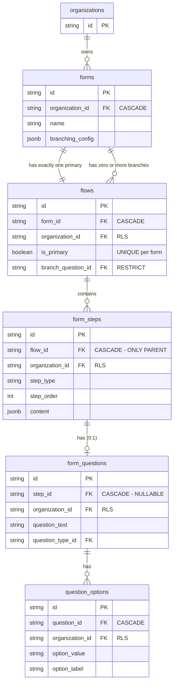
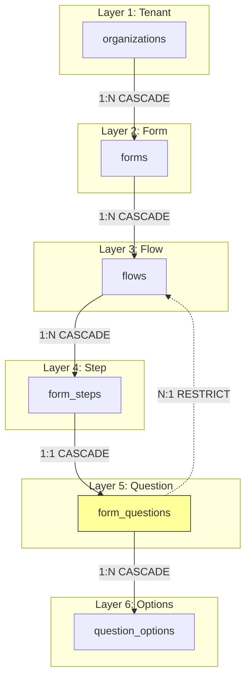
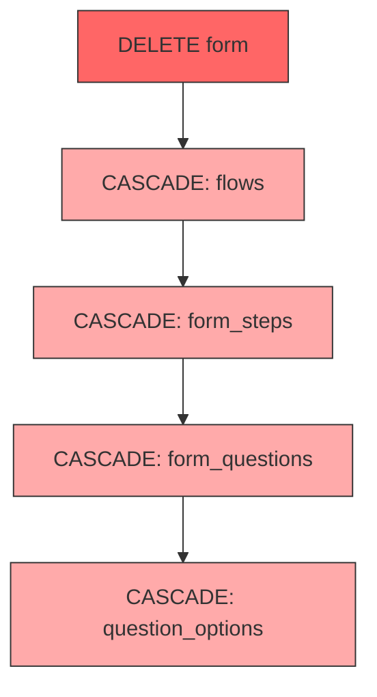
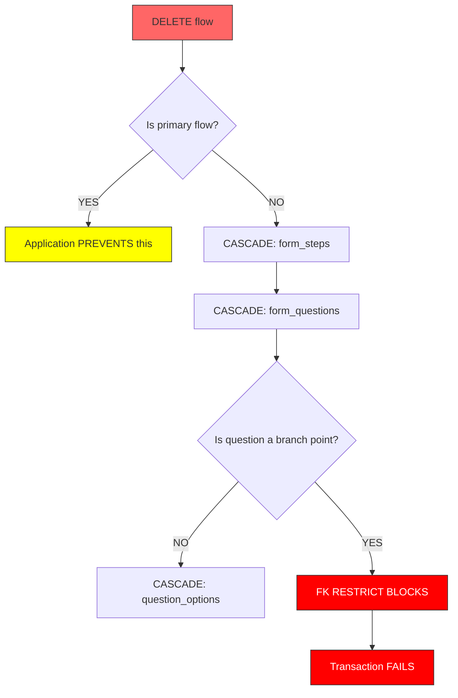
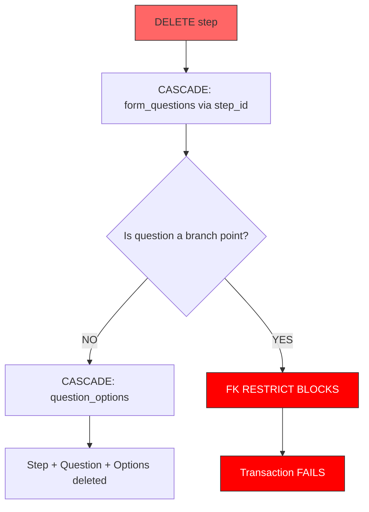
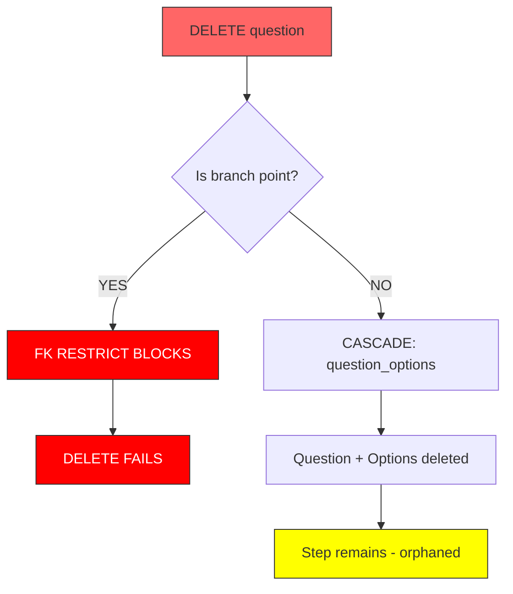
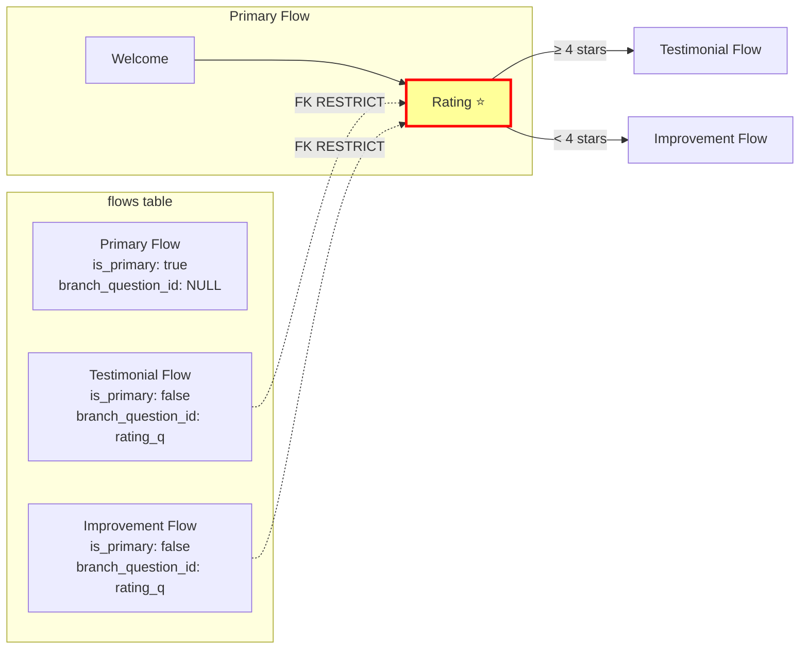
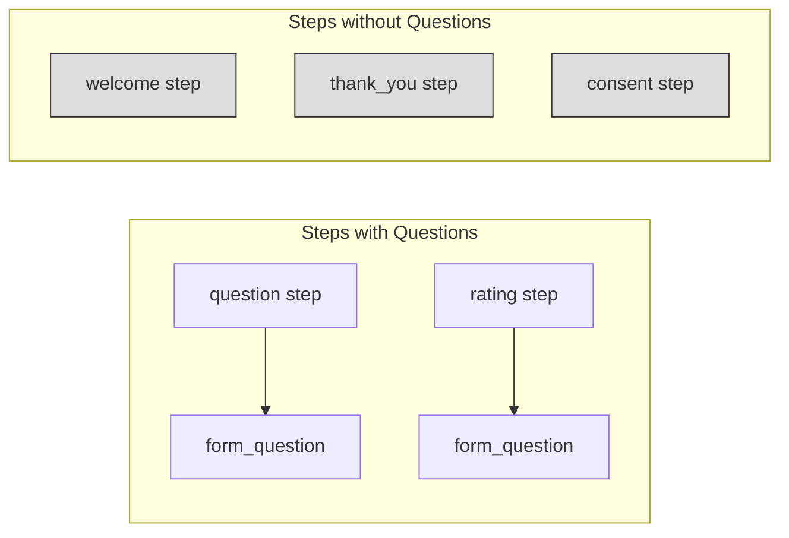

# Form Data Model & Cascade Behaviors

## Overview

This document maps the database entity hierarchy, foreign key relationships, and delete cascade behaviors for the form-related tables.

**Schema Definition:** See `docs/adr/013-form-entities-schema-refactoring/adr.md` for the authoritative schema specification.

---

## Entity Hierarchy

### Clean Ownership Chain

The ownership model follows a simple linear hierarchy:

```
form → flow → step → question → options
```



### Key Design Principles

| Principle | Implementation |
|-----------|----------------|
| **Single Parent** | Each entity has exactly one owning parent |
| **Linear Cascade** | Delete cascades follow the ownership chain |
| **RLS Denormalization** | `organization_id` on all tables for Hasura row-level security |
| **No Redundant FKs** | Derive form via joins: `question.step.flow.form_id` |

---

## Foreign Key Relationships



**Note:** The dashed line shows `flows.branch_question_id → form_questions.id` (RESTRICT) for branch point protection.

---

## FK Constraints Summary

### forms

| Column | References | ON DELETE |
|--------|------------|-----------|
| `organization_id` | organizations.id | CASCADE |

### flows

| Column | References | ON DELETE | Notes |
|--------|------------|-----------|-------|
| `form_id` | forms.id | CASCADE | |
| `organization_id` | organizations.id | CASCADE | RLS |
| `branch_question_id` | form_questions.id | **RESTRICT** | Protects branch points |

### form_steps

| Column | References | ON DELETE | Notes |
|--------|------------|-----------|-------|
| `flow_id` | flows.id | CASCADE | **Only parent** |
| `organization_id` | organizations.id | CASCADE | RLS |

### form_questions

| Column | References | ON DELETE | Notes |
|--------|------------|-----------|-------|
| `step_id` | form_steps.id | CASCADE | **Nullable** - steps without questions |
| `organization_id` | organizations.id | CASCADE | RLS |
| `question_type_id` | question_types.id | RESTRICT | |

### question_options

| Column | References | ON DELETE |
|--------|------------|-----------|
| `question_id` | form_questions.id | CASCADE |
| `organization_id` | organizations.id | CASCADE |

---

## Delete Cascade Scenarios

### Scenario 1: Delete Form (Clean Cascade)



**Result:** Single cascade chain cleans everything. No triggers needed.

---

### Scenario 2: Delete Flow



**Application Rule:** Never delete the primary flow. Delete the form instead.

---

### Scenario 3: Delete Step



**Note:** The FK on `form_questions.step_id` handles cascade automatically. No trigger needed.

---

### Scenario 4: Delete Question Directly



**Application Rule:** Delete the step, not the question directly. Step deletion cascades cleanly.

---

## Branch Point Protection

A **branch point** is a question (typically rating) that determines which flow path the respondent takes.



### Protection Rules

| Operation | Branch Point Question | Non-Branch Question |
|-----------|----------------------|---------------------|
| Delete question directly | **BLOCKED** | Allowed |
| Delete step with question | **BLOCKED** | Allowed (cascades) |
| Delete flow containing step | **BLOCKED** | Allowed (cascades) |
| Delete form | **ALLOWED** | Allowed |

### How to Delete a Branch Point Question

```typescript
// 1. First disable branching (clears branch_question_id on flows)
await disableBranching(formId);

// 2. Now safe to delete the step (cascades to question)
await deleteStep(ratingStepId);
```

---

## Step-Question Relationship

### Steps Can Exist Without Questions

The `step_id` on `form_questions` is **nullable** because some step types don't have questions:

| Step Type | Has Question |
|-----------|--------------|
| `welcome` | No |
| `thank_you` | No |
| `consent` | No |
| `question` | Yes |
| `rating` | Yes |
| `multiple_choice` | Yes |



---

## Delete Behavior Matrix

| Entity Deleted | flows | form_steps | form_questions | question_options |
|----------------|-------|------------|----------------|------------------|
| **form** | CASCADE | CASCADE | CASCADE | CASCADE |
| **flow** | - | CASCADE | CASCADE | CASCADE |
| **step** | - | - | CASCADE | CASCADE |
| **question** | RESTRICT* | - | - | CASCADE |
| **option** | - | - | - | - |

\* Only if question is a branch point

---

## Application Code Patterns

### Creating Entities (Top-Down)

```typescript
// 1. Create form
const form = await createForm({ organization_id, name });

// 2. Create primary flow
const flow = await createFlow({
  form_id: form.id,
  organization_id,
  is_primary: true
});

// 3. Create step
const step = await createFormStep({
  flow_id: flow.id,
  organization_id,
  step_type: 'question',
  step_order: 0
});

// 4. Create question (references step)
const question = await createFormQuestion({
  step_id: step.id,
  organization_id,
  question_text: 'How would you rate us?'
});

// 5. Create options
await createQuestionOptions({
  question_id: question.id,
  organization_id,
  options: [...]
});
```

### Deleting Entities (Let Cascade Handle It)

```typescript
// ✅ CORRECT: Delete form, cascade handles everything
await deleteForm(formId);

// ✅ CORRECT: Delete step, cascade handles question + options
await deleteFormStep(stepId);

// ⚠️ AVOID: Deleting question directly (orphans step)
// await deleteFormQuestion(questionId);
```

### Safe Step Deletion

```typescript
async function safeDeleteStep(stepId: string): Promise<void> {
  const step = await getStep(stepId);

  // Check if associated question is a branch point
  if (step.question?.id) {
    const isProtected = await isBranchPointQuestion(step.question.id);
    if (isProtected) {
      throw new Error(
        'Cannot delete step: question is branch point. Disable branching first.'
      );
    }
  }

  // Safe to delete - FK cascade handles question cleanup
  await deleteFormStep(stepId);
}
```

---

## Querying Across Hierarchy

### Get Steps by Form

```graphql
query GetFormSteps($formId: String!) {
  form_steps(
    where: { flow: { form_id: { _eq: $formId } } }
    order_by: [
      { flow: { display_order: asc } },
      { step_order: asc }
    ]
  ) {
    id
    step_type
    step_order
    flow_id
    question {
      id
      question_text
      options { id option_label option_value }
    }
  }
}
```

### Get Questions by Form

```graphql
query GetFormQuestions($formId: String!) {
  form_questions(
    where: { step: { flow: { form_id: { _eq: $formId } } } }
  ) {
    id
    question_text
    step_id
    step {
      id
      step_type
      flow_id
    }
  }
}
```

---

## References

- `docs/adr/013-form-entities-schema-refactoring/adr.md` - Authoritative schema specification
- `docs/adr/009-step-based-form-architecture/adr.md` - Step/flow architecture decisions
