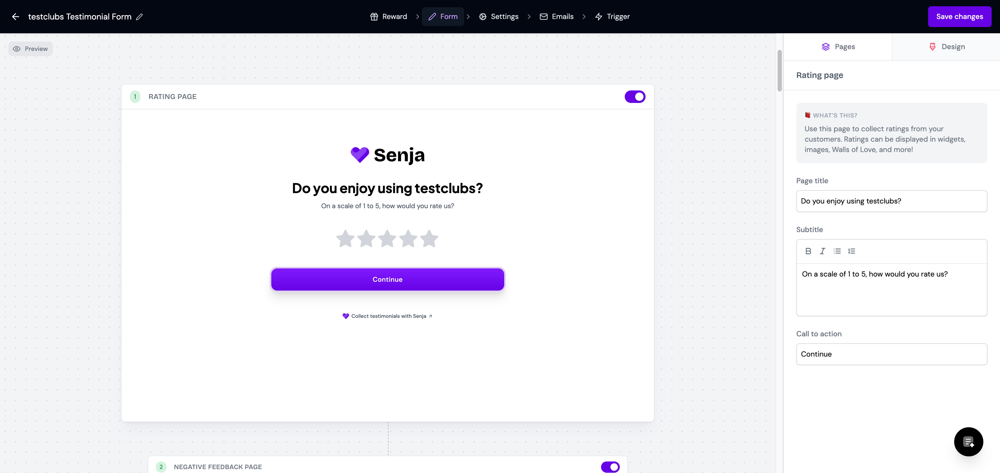
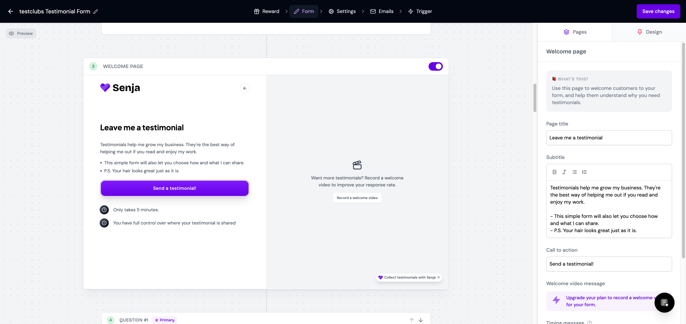
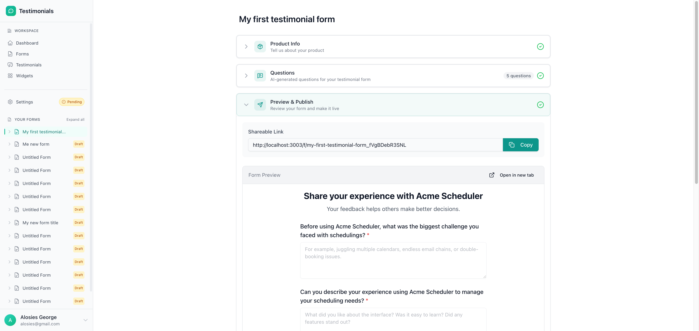
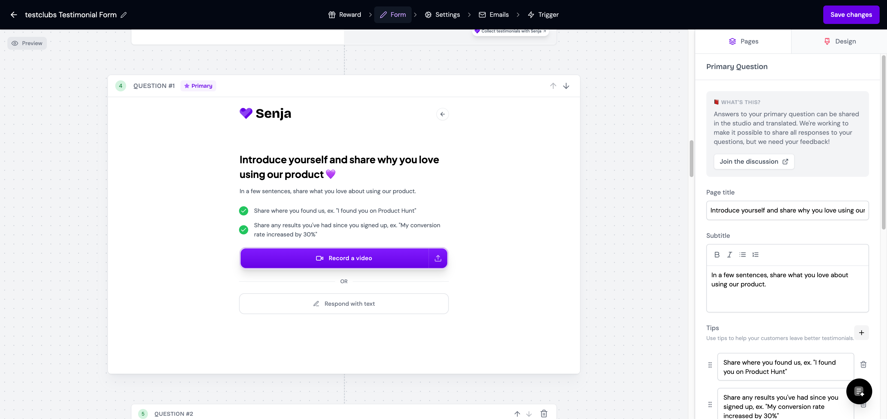
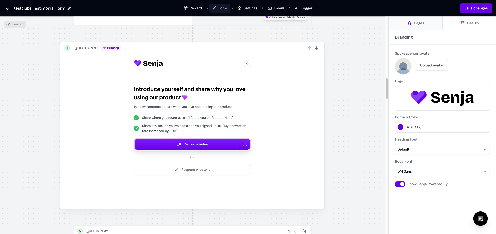

# Senja Form Editor UX Analysis

**Date:** January 3, 2026
**Purpose:** Document Senja's form editor UX patterns to inform improvements to our form editing experience.

## Overview

Senja's form editor provides a highly intuitive experience for creating testimonial collection forms. The key differentiator is their **"form as a journey"** approach—users see and edit the entire customer flow in a single scrollable view with live previews.

## Screenshots

### Form Editor Overview



The main editor shows:
- **Top navigation:** Reward → Form → Settings → Emails → Trigger
- **Left panel:** Scrollable list of all form pages with live iframe previews
- **Right panel:** Editing controls for the selected page
- **Pages/Design tabs:** Toggle between content editing and theming

---

## Core UX Patterns

### 1. Vertical Scroll Layout with Live Previews

The entire form flow is visible in a single scrollable view. Each step/page has its own live iframe preview showing exactly what customers will see.



**Key benefits:**
- Users see the complete customer journey at a glance
- Changes are reflected immediately in the preview
- No mental model switching between "edit mode" and "preview mode"

**Our current approach comparison:**



Our editor uses wizard-style panels (Product Info → Questions → Preview) that collapse/expand, showing all questions in a single static preview rather than the step-by-step experience.

---

### 2. Numbered Step Indicators

Every page has a clear numbered badge (1, 2, 3...) making the flow explicit:

```
1  Rating page
2  Negative feedback page
3  Welcome page
4  Question #1 (Primary)
5  Question #2
6  Private Feedback
7  Consent page
8  About you page
9  About company page
10 Ready to send page
11 Thank you & Word of mouth page
```

This helps users understand exactly what customers experience at each step.

---

### 3. Click-to-Edit Page Headers

Each page has a clickable header that reveals the editing panel on the right. The selected page is highlighted with an active state.

**Structure of a page header:**
```
[Step Number] [Page Title] [Optional: Primary badge] [Reorder controls]
```

For questions, there are up/down arrows to reorder and a delete button.

---

### 4. In-Context Help ("What's this?")

Each page type has a collapsible explanation section:



Examples:
- **Rating page:** "Use this page to collect ratings from your customers. Ratings can be displayed in widgets, images, Walls of Love, and more!"
- **Welcome page:** "Use this page to welcome customers to your form, and help them understand why you need testimonials."
- **Primary Question:** "Answers to your primary question can be shared in the studio and translated."

---

### 5. Question Tips System

Questions have a "Tips" section with draggable, editable tips that guide customers:

```
Tips
Use tips to help your customers leave better testimonials.

💡 Share where you found us, ex. "I found you on Product Hunt"
💡 Share any results you've had since you signed up, ex. "My conversion rate increased by 30%"
```

Tips appear as bullet points below the question in the preview, helping customers provide more valuable testimonials.

---

### 6. Response Type Toggle

Questions have a segmented control for response format:

```
Let customers respond with:
[Video and text] [Video] [Text]
```

Additional options include:
- Video response duration (15 seconds to 1 hour)
- Collect image attachments toggle

---

### 7. Primary Question Designation

One question can be marked "Primary" with special treatment:
- Gets a badge: `Question #1 [Primary]`
- Can be shared in widgets
- Can be translated
- Answer is featured in testimonial displays

---

### 8. Rich Text Editing for Subtitles

Subtitle fields have formatting controls:
- Bold, Italic, Underline, Strikethrough
- Bullet lists

This allows richer, more expressive welcome messages and instructions.

---

### 9. Customizable Labels

Each question page has customizable CTA labels:

| Field | Default Value |
|-------|---------------|
| Video prompt CTA text | "Record a video" |
| Text prompt CTA text | "Respond with text" |
| Text response placeholder | "Write your testimonial..." |
| Call to action | "Continue" |
| Restart call to action | "Restart" |

---

### 10. Design Tab Separation



Theming and branding are in a separate "Design" tab, keeping the "Pages" tab focused purely on content structure. This separation reduces cognitive load.

---

### 11. Form Page Types

Senja includes specialized page types beyond just questions:

| Page Type | Purpose |
|-----------|---------|
| **Rating page** | NPS-style rating collection (1-5 stars) |
| **Negative feedback page** | Shown when rating is low, captures private feedback |
| **Welcome page** | Introduction with CTA, timing estimate, consent preview |
| **Question pages** | Video/text response questions |
| **Private Feedback** | Optional private feedback not shared publicly |
| **Consent page** | Public vs private sharing consent |
| **About you page** | Name, email, photo collection |
| **About company page** | Job title, company, website, logo |
| **Ready to send page** | Review answers before submission |
| **Thank you page** | Confirmation with social sharing, referral codes |

---

### 12. Smart Conditional Flow

The Rating page determines the flow:
- **Low rating (1-3):** Routes to "Negative feedback page" for private feedback
- **High rating (4-5):** Routes directly to "Welcome page" for testimonial collection

This protects the brand by not publishing negative testimonials while still capturing feedback.

---

## Recommendations for Our Form Editor

### High Priority

1. **Add live step-by-step preview**
   Show each question as a separate step with its own preview, not all questions in one form.

2. **Add numbered step indicators**
   Make the customer journey explicit with numbered badges.

3. **Add question tips/prompts**
   Let users add example prompts that guide customers to better answers.

4. **Add in-context help**
   Brief explanations of what each section does and why.

### Medium Priority

5. **Add response type toggle**
   Video / Text / Both options per question.

6. **Add primary question designation**
   Mark one question as the "featured" answer for widgets.

7. **Add rich text for descriptions**
   Basic formatting for welcome messages.

8. **Add consent page**
   Let customers choose public vs private sharing.

### Lower Priority

9. **Add rating page with conditional routing**
   Route low ratings to private feedback instead of testimonials.

10. **Add thank you page customization**
    Social sharing, referral codes, custom messages.

11. **Separate Design tab**
    Move theming to its own tab to reduce clutter.

---

## Key Insight

**Senja treats the form as a journey, not a document.**

Each step gets its own preview so users understand exactly what customers see at each moment. This is fundamentally different from our current approach of showing all questions in a single static preview.

The form editor should feel like you're designing an experience, not filling out a configuration panel.
